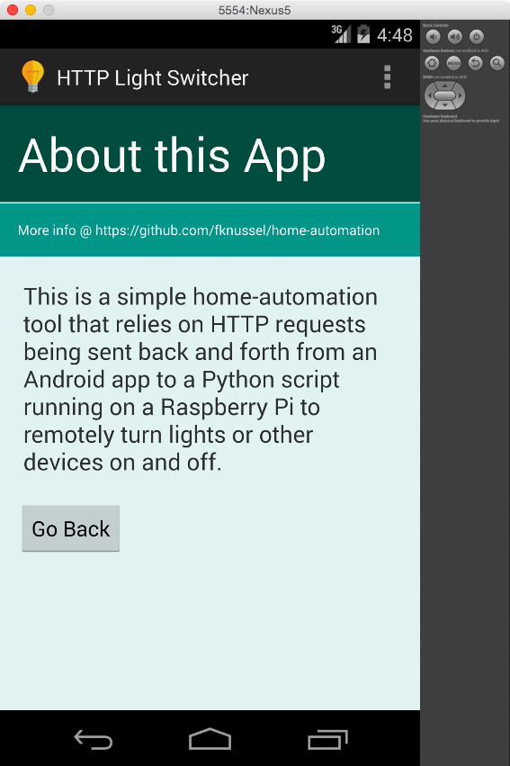
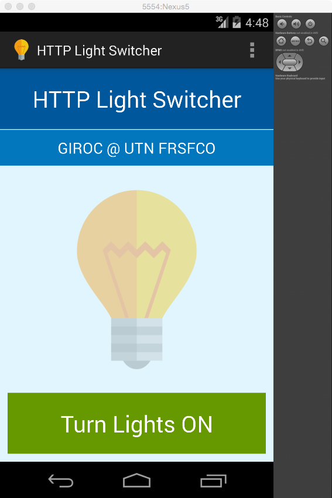
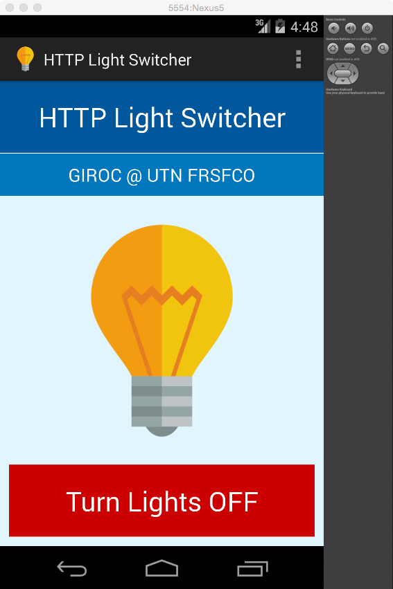

Home Automation
===============

#### Domotics project using an Android device and a Raspberry Pi.

> This is a simple home-automation tool that relies on HTTP requests being sent back and forth from an Android app to a Python script running on a Raspberry Pi to remotely turn lights or other devices on and off.

Project Features
==
TO DO

Architecture
==
TO DO

Screenshots
==

<table style="text-align: center;">
	<tr>
		<td></td>
		<td></td>
	</tr>
	<tr>
		<td></td>
		<td></td>
	</tr>
</table>

Useful Links
==

Home automation with Raspberry Pi:
* http://www.makeuseof.com/tag/how-to-build-home-automation-system-raspberry-pi-and-arduino/
* http://www.instructables.com/id/Raspberry-Pi-GPIO-home-automation/
* http://www.penguintutor.com/electronics/simple-homeautomation-raspberrypi

Simple RESTful API using Python:
* http://blog.miguelgrinberg.com/post/designing-a-restful-api-with-python-and-flask

Home automation with Raspberry PI and Arduino using Node.js, MongoDB, HTML5 and Websockets:
* http://ni-c.github.io/heimcontrol.js/