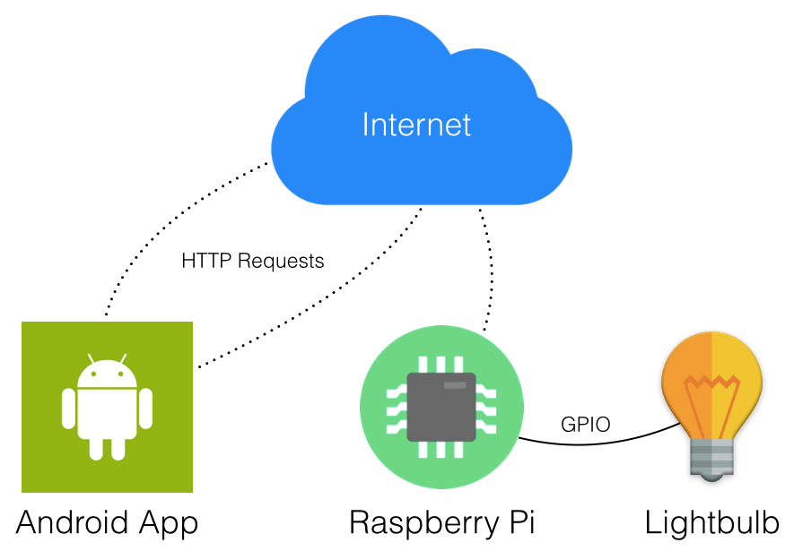
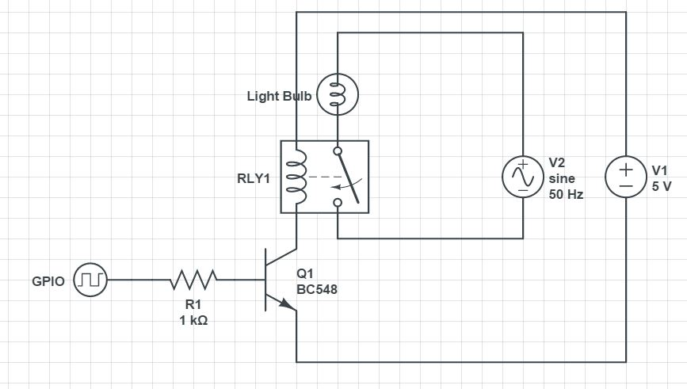

Home Automation
===============

#### Switching lights remotely with a Raspberry Pi and an Android device

> This is a simple home automation tool that relies on HTTP requests being sent back and forth from an Android app to a Python script running on a Raspberry Pi to remotely turn lights or other devices on and off.

Architecture
==

The system architecture is somewhat simple, it consists of an Android application running on any Android device, a Raspberry Pi connected to the Internet and a

Here's an overview of the project:

The Android app is located under the [LightSwitch](https://github.com/fknussel/home-automation/tree/master/LightSwitch) folder of this repo, whereas the RESTful API developed in Python can be found on the [Raspi](https://github.com/fknussel/home-automation/tree/master/Raspi) folder.

Network Configuration
====

In order for the system to work, you need to configure the IP address that the Raspberry Pi got assigned when connecting to the private network within the Android application. In order to do so, pop open the `networking/RaspiClient.java` file and change the value of the `API_URL` var accordingly.

Wiring the Pi
====

In order to turn on and off the lightbulb, a relay is controlled through a BC548 NPN transistor from the Raspberry Pi:

Screenshots
==

<table style="text-align: center;">
	<tr>
		<td></td>
		<td></td>
	</tr>
	<tr>
		<td></td>
		<td></td>
	</tr>
</table>

Useful Links
==

Home automation with Raspberry Pi:
* http://www.makeuseof.com/tag/how-to-build-home-automation-system-raspberry-pi-and-arduino/
* http://www.instructables.com/id/Raspberry-Pi-GPIO-home-automation/
* http://www.penguintutor.com/electronics/simple-homeautomation-raspberrypi

Simple RESTful API using Python:
* http://blog.miguelgrinberg.com/post/designing-a-restful-api-with-python-and-flask

Home automation with Raspberry PI and Arduino using Node.js, MongoDB, HTML5 and Websockets:
* http://ni-c.github.io/heimcontrol.js/

GPIO libraries:
* http://pythonhosted.org/RPIO/rpio_py.html#ref-rpio-py-additions
* http://makezine.com/projects/tutorial-raspberry-pi-gpio-pins-and-python/
* https://pypi.python.org/pypi/RPi.GPIO